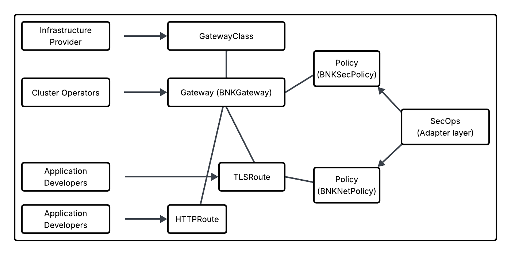
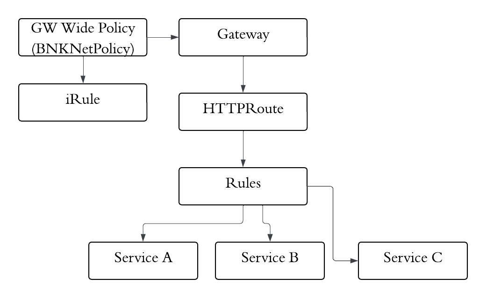

## BNK links

[BNK Gateway API](https://clouddocs.f5.com/bigip-next-for-kubernetes/latest/installing-bnk-dpu-using-f5-lifecycle-operator/installing/bnk-gateway-api.html)

Standard Gateway API [HTTPRoute](https://clouddocs.f5.com/bigip-next-for-kubernetes/latest/bnk-gateway-api-httproute.html)

F5 CRs

[Master List](https://clouddocs.f5.com/bigip-next-for-kubernetes/latest/installing-bnk-dpu-using-f5-lifecycle-operator/installing/spk-custom-resources.html) CR

- [L4Route](https://clouddocs.f5.com/bigip-next-for-kubernetes/latest/bnk-gateway-api-l4route.html)

- F5SPKEgress [Egress](https://clouddocs.f5.com/bigip-next-for-kubernetes/latest/spk-egress-crd.html)
  
- [F5BigFwPolicy](https://clouddocs.f5.com/bigip-next-for-kubernetes/latest/bnk-fwpolicy-in-gateway-api.html)

- iRule [BNKNetPolicy](https://clouddocs.f5.com/bigip-next-for-kubernetes/latest/bnk-irule-in-gatewayapi.html)
  
    - applied at Gateway or Gateway Listener (max 64 listeners)

- General [BNKNetPolicy](https://clouddocs.f5.com/bigip-next-for-kubernetes/latest/bnk-bnkNetPolicy.html)

- [F5SPKSnatpool](https://clouddocs.f5.com/service-proxy/latest/spk-snatpool-crd.html)
  
    - By default, all SNAT Pool IP addresses are advertised (redistributed) to BGP neighbors. To advertise only specific SNAT Pool IP addresses, configure a prefixList and routeMaps when installing the Ingress Controller.

- [F5BNKGateway](https://clouddocs.f5.com/bigip-next-for-kubernetes/2.1.1/bnk-ficforgatewayapi.html) Sometimes reffered to as FIC (F5 IPAM Controller)

- [F5BNKGateway CR](https://clouddocs.f5.com/bigip-next-for-kubernetes/latest/bnk-gateway-api-gateway.html)

- https://clouddocs.f5.com/bigip-next-for-kubernetes/latest/bnk-bnkgateway.html

- [BNKSecPolicy](https://clouddocs.f5.com/bigip-next-for-kubernetes/latest/bnk-bnkSecPolicy.html)

    - BNKSecPoliy + FW [examples](https://clouddocs.f5.com/bigip-next-for-kubernetes/latest/reference/spk-firewall-crd.html)

## AI

[AI Optimize](https://clouddocs.f5.com/bigip-next-for-kubernetes/latest/how-tos/ai-related-features/)
